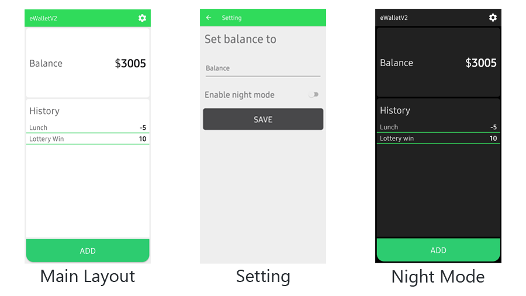

#  eWallet
This app is the utility app built for university project. In this app, user can set the amount that the want to keep record. Also, user can change the theme in the sitting.

## Mockup

## Built with
* [Native Android (Java)](https://developer.android.com) - Used language
* [Gson](https://github.com/google/gson) - Used to keep the record 

## Author
* **Christopher Thiha Aung** - *Software Developer* - [LinkedIn](https://www.linkedin.com/in/christopher-t-678b41171/)

## License
This project is licensed under the MIT License - see the [LICENSE](LICENSE) file for details
